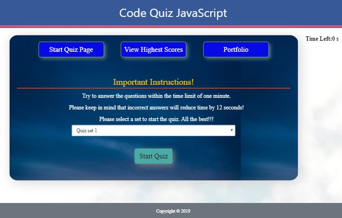

# Code-Quiz
To build a timer-based quiz application that stores high scores client-side. Using Web APIs. This application runs in the browser and feature dynamically updated HTML and CSS powered by JavaScript code. Here Web APIs and interfaces, like the Page Visibility API, and Document Object Model (DOM), timer, Form events, Keyboard and mouse events etc. 

## Getting Started

Build a timer-based quiz application that stores high scores client-side.

```

A timed quiz on JavaScript fundamentals that stores high scores so that one can gauge my progress compared to my peers.

### Content based on use case

The user will be prompted to choose one form the two set of quiz:

  * Time allowed is one minute
  * 5 quesions to answer

  ### Prerequisites

This file opens in all the browsers, but chrome (including chrome for mobile devices) has been deemed as the browser for best results.

### Accessing

This web application / can be accessed via the link https://amitabh-k.github.io/Code-Quiz/

## Running the tests

Use Inspect Element of Google Chrome to test the responsiveness of the webpage’s on various screen sizes.

## Technologies

* JavaScript
* HTML
* CSS
* Bootstrap CSS framework for responsive, mobile-first front-end web development

## Author

* **Amitabh Kumar**

## Acknowledgments

* Ali Maqsood for all content delivery
* David Bland's (instructor) help on Animations and the content delivery
